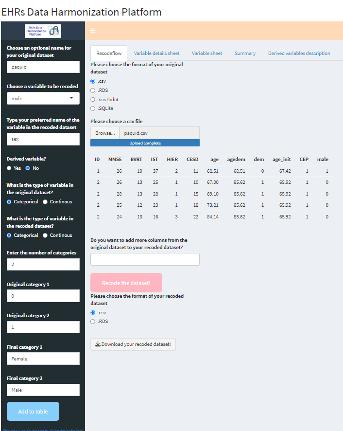

# Summary
Electronic health records (EHRs) contain important longitudinal information on individuals who have received medical care. Traditionally, EHRs have been used to support a wide range of administrative activities such as billing and clinical workflow, but, given the depth and breadth of clinical and demographic data they contain, they are increasingly being used to provide real-world data for research.  Although EHR data have enormous research potential, the full realization of that potential requires a data management strategy that extracts from large EHR databases, that are collected from a range of care settings and time periods, well-documented research-relevant data that can be used by different researchers. Having a common well-documented data management strategy for EHR will support reproducible research and sharing documentation on research variables that are derived from EHR variables is important to open science. In this short paper, we describe the *EHRs Data Harmonization Platform*.  The platform is based on an easy to use web app a publicly available at [https://poxotn-arian-aminoleslami.shinyapps.io/Arian/](https://poxotn-arian-aminoleslami.shinyapps.io/Arian/) and as a standalone software package at [https://github.com/ArianAminoleslami/EHRs-Data-Harmonization-Platform](https://github.com/ArianAminoleslami/EHRs-Data-Harmonization-Platform), that is linked to an existing R library for data harmonization called `recodeflow`. 

# Statement of need
The process of making EHR data available for research can be divided into two main steps. 
The first step is the selection and description of the specific variables that the data custodian or owner makes available from the EHRs for research purposes and the second step is the process through which individual research teams select and modify variables that are made available to them. 
It allows the data custodians to select data elements that they feel are sufficiently well characterized and accurate enough to support the scientific research and importantly allows them to explicitly deal with concerns about protecting the privacy of individuals whose person health information is contained in the EHRs [@fortier2017maelstrom].

The second step in using EHR data for scientific purposes involves selecting the variables from those data sources that are relevant to a specific research project, and creating or deriving research study variables from the available data.  
This step may vary from research team to research team.  
For example, a research team focused on breast cancer might focus on using diagnostic codes from hospital inpatient data that identify individuals with different types of breast cancer and then linking to outpatient prescription drug  data to identify the specific breast cancer treatments they receive, while a research team looking at emergency room waiting times might focus on data from emergency rooms and define waiting time as the time between registration and assessment. Both teams are drawing from the same publicly available data sources but are drawing on different data elements and creating or deriving research variables from those data elements. An important aspect of multiple research teams making use of common data sources is open science, the notion that science will progress faster if data and knowledge are shared  [@burgelman2019open].

# Overview
The EHRs Data Harmonization Platform is an easy to use publicly available Shiny app that draws on an existing R library: `recodeflow`.
The R library `recodeflow` was developed as an extension of `cchsflow`  [@yusuf2021cchsflow; @WWW-CCHSFLOW] and itself relies on `sjmisc`  [@ludecke2018sjmisc]. 
The platform creates shareable documentation of EHR data extraction and derivation that can not only support efforts to make research reproducible, but also will allow researchers to share strategies for data extraction and variable derivation.

Our platform not only helps in creating the above-mentioned spreadsheets in a user-friendly environment, but also gives the opportunity to users to implement the recoding process on their datasets by taking simple steps. It also documents all essential information (such as the functions’ codes to create the derived variables and their names) and therefore, other researchers can reproduce an already existing work by only uploading the required documentation to the app. 

To be more specific, non-recoded data can be imported to the app with various format such as CSV, SAS7BDAT, RDS, and SQLite.  
There are also options to handle large datasets to be imported to the app in smaller chunks. Users can create a details sheet from scratch using the basic transformations available in `recodeflow` (for example, renaming a variable, creating a categories out of a continuous variable, etc.) or creating more complicated derived variables that has more than one components and needs functions to be coded. The platform then uses the information stored in the created spreadsheets to perform the curation on the dataset. The advantage of this standard approach is that once other users want to perform the same curation on a dataset, they don’t need to create everything from scratch. These spreadsheets could be shared with other users, and they can upload them to the platform, modify them if needed, connect their non-curated database and reproduce the same curation on their database. The platform gives the flexibility to the users to save the curated database in various formats. 

# Usage
The shinyapp has six main tabs. The *Recodeflow* tab is where we connect/upload the non\_curated database and once we used the sidebar panel and updated *variable details sheet* and *variable sheet*, we can determine the output of the recoded dataset and start the recoding process by clicking on the *recoded* data.  One important step in curation is to have information of how a variable really looks in a non-curated database. The *summary* tab allows users to extract information about a variable in the database, see the distribution of different categories and have a better understanding of the variable they wish to recode. Finally, there’s the *derived variables documentation* tab that stores the information of derived variables which use a pre-programmed, custom function such as: the R code of the function and the name of the function.

**Renaming a variable and recode the categories**.
One of the most common curations in databases is to rename a variable. In our example, there’s a *male* variable in Paquid dataset which gets binary values of 0,1. We want to first rename the variable to *sex* and then recode it so that 0 represents *Female* and 1 would be *Male*. To do so, we should first follow the following initial steps:

1. We upload the Paquid dataset by selecting .csv, clicking on *Browse*, and selecting the paquid.csv file
on our computer. This CSV file is available within our GitHub repository (*Data availability* section);
2. (Optional) We call this dataset Paquid by writing it in the *Choose an optional name for your original dataset* field;

After these preliminary steps, we need to follow these steps: 

3. Choose the *male* variable;
4. Type our preferred new name for the variable which is *sex*; 
5. Choose the original and recoded data type which is Categorical to Categorical;
6. Enter the number of categories which is 2, and enter how categories should be recoded;

Once all these steps are done, we only need to add the information to the details sheet by clicking on the *add to table* button (\autoref{fig:Gender})

# Acknowledgements
The authors thank Dorsa Ghahramani (University of Toronto) and Douglas Manuel (the Ottawa Hospital) for their help.

# Conflict of interest
The authors declare they have no conflict of interest.

# Funding
This study is part of the Broad and Deep Longitudinal Analysis in Neurodegenerative Disease (BRAIN) project and is supported by the Canadian Institutes of Health Research (CIHR), in partnership with CIHR's Institute of Aging and CIHR's Institute of Neuroscience, Mental Health and Addiction (CIHR Funding Reference Number: BDO 148341).
This study also was funded by the European Union – Next Generation EU programme, in the context of The National Recovery and Resilience Plan, Investment Partenariato Esteso PE8 *Conseguenze e sfide dell'invecchiamento*, Project Age-It (Ageing Well in an Ageing Society) and also partially supported by Ministero dell'Universit\`a e della Ricerca of Italy under the *Dipartimenti di Eccellenza 2023-2027* ReGAInS grant assigned to Dipartimento di Informatica Sistemistica e Comunicazione at Università di Milano-Bicocca.
The funders had no role in study design, data collection and analysis, decision to publish, or preparation of the manuscript.

# Ethics approval and consent to participate
Ethics approval and consent to participate from the patients to the Paquid study were collected by the dataset original curators [@letenneur1994incidence].

# Data availability
The Paquid dataset used in this study is publicly available within the `lcmm` R software package and on our GitHub repository at: 
[https://github.com/ArianAminoleslami/EHRs-Data-Harmonization-Platform/blob/main/data/paquid.csv](https://github.com/ArianAminoleslami/EHRs-Data-Harmonization-Platform/blob/main/data/paquid.csv)

More information about the Paquid dataset can be found in the study by Luc Letenneur and colleagues [@letenneur1994incidence] and on CRAN at: [https://search.r-project.org/CRAN/refmans/lcmm/html/paquid.html](https://search.r-project.org/CRAN/refmans/lcmm/html/paquid.html)

# Software availability
Our R package source code is publicly available under the GPL-3.0 license on GitHub at: 
[https://github.com/ArianAminoleslami/EHRs-Data-Harmonization-Platform](https://github.com/ArianAminoleslami/EHRs-Data-Harmonization-Platform)

Our Shiny app is also available via web browser under the GPL-3.0 license and can be accessed through internet browser at: [https://poxotn-arian-aminoleslami.shinyapps.io/Arian/](https://poxotn-arian-aminoleslami.shinyapps.io/Arian/)

This manuscript refers to the release v1.0.1 of our platform.

# References
